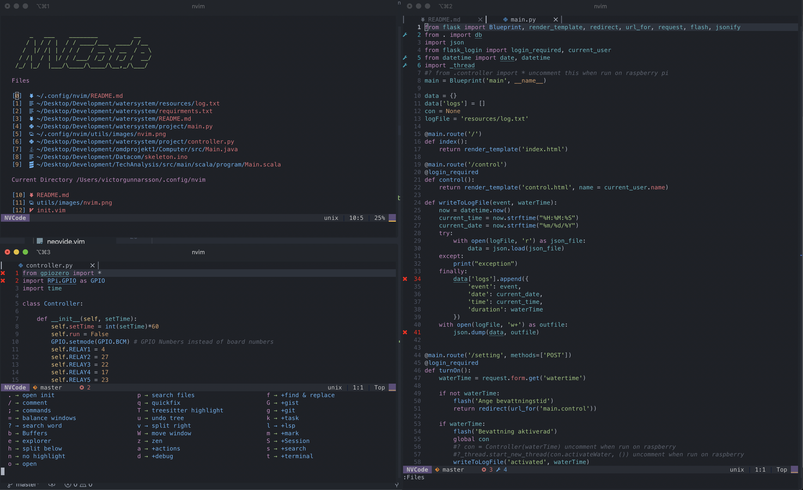

# NVCode   [](https://opensource.org/licenses/MIT)



## Install in one command

The following will install this config if you have an existing config it will move it to `~/.config/nvim.old`

This script only supports Mac, Ubuntu and Arch

```
bash <(curl -s https://raw.githubusercontent.com/VGDev1/nvim/master/utils/install.sh)
```

## Install Neovim

- Mac

  ```
  brew install neovim

  brew install --HEAD neovim # Latest

  brew upgrade neovim --fetch-HEAD # Sometimes you need to update
  ```

- Ubuntu

  ```
  sudo apt install neovim # This may not provide the newest version
  ```

- Arch

  ```
  yay -S neovim-nightly-git # Latest
  ```

## Clone this repo into your config

```
git clone https://github.com/VGDev1/nvim.git ~/.config/nvim
```

## Install python & node support

```
pip install pynvim
```

```
npm i -g neovim
```

## Install Neovim remote

```
pip install neovim-remote
```

## Install Yarn

- Mac

  ```
  brew install yarn
  ```

- Ubuntu

  ```
  curl -sS https://dl.yarnpkg.com/debian/pubkey.gpg | sudo apt-key add -
  echo "deb https://dl.yarnpkg.com/debian/ stable main" | sudo tee /etc/apt/sources.list.d/yarn.list
  sudo apt update && sudo apt install yarn
  ```

- Arch

  ```
  pacman -S yarn
  ```

## Install clipboard support

- On Mac pbcopy should be builtin

- Ubuntu

  ```
  sudo apt install xsel
  ```

- Arch

  ```
  sudo pacman -S xsel
  ```

## (Optional) Install python & node support using virtual environments

Make sure to add these paths somewhere in your config

```
let g:python3_host_prog = expand("<path to python with pynvim installed>")
let g:python3_host_prog = expand("~/.miniconda/envs/neovim/bin/python3.8") " <- example

let g:node_host_prog = expand("<path to node with neovim installed>")
let g:node_host_prog = expand("~/.nvm/versions/node/v12.16.1/bin/neovim-node-host") " <- example
```

## Included Plugins

I recommend reading the docs of these plugins to understand them better. Each plugin provides a much better Vim experience!

- [vim-commentary](https://github.com/tpope/vim-commentary): Better comments
- [vim-radical](https://github.com/glts/vim-radical): Convert binary, hex, etc..
- [vim-repeat](https://github.com/tpope/vim-repeat'): Repeat stuff
- [quick-scope](https://github.com/unblevable/quick-scope): Text Navigation
- [vim-multiple-cursors](https://github.com/terryma/vim-multiple-cursors): Multiple cursors
- [vim-better-comments](https://github.com/jbgutierrez/vim-better-comments): Colored comments
- [neoformat](https://github.com/sbdchd/neoformat): Formatter
- [vim-easymotion](https://github.com/easymotion/vim-easymotion): Easymotion
- [vim-surround](https://github.com/tpope/vim-surround): Surround
- [vim-rooter](https://github.com/airblade/vim-rooter): Have the file system follow you around
- [vim-sleuth](https://github.com/tpope/vim-sleuth): Auto set indent settings
- [vim-polyglot](https://github.com/sheerun/vim-polyglot): Better Syntax Support
- [nvim-treesitter](https://github.com/nvim-treesitter/nvim-treesitter) [vim-treesitter/playground](https://github.com/vim-treesitter/playground): Treesitter
- [nvim-web-devicons](https://github.com/kyazdani42/nvim-web-devicons)[vim-devicons](https://github.com/ryanoasis/vim-devicons): Cool icons
- [auto-pairs](https://github.com/jiangmiao/auto-pairs): Auto pairs for '(' '[' '{'
- [vim-closetag](https://github.com/alvan/vim-closetag): Closetags for html
- [nvcode-color-schemes.vim](https://github.com/christianchiarulli/nvcode-color-schemes.vim) [onedark.vim](https://github.com/joshdick/onedark.vim): Themes
- [coc.nvim](https://github.com/neoclide/coc.nvim): Intellisense
- [galaxyline.nvim](https://github.com/glepnir/galaxyline.nvim) [rnvimr](https://github.com/kevinhwang91/rnvimr): Status Line
- [fzf](https://github.com/junegunn/fzf)
  [fzf-preview.vim](https://github.com/yuki-ycino/fzf-preview.vim)
  [fzf.vim](https://github.com/junegunn/fzf.vim): FZF
- [vim-gitgutter](https://github.com/airblade/vim-gitgutter)
  [vim-fugitive](https://github.com/tpope/vim-fugitive)
  [vim-rhubarb](https://github.com/tpope/vim-rhubarb)
  [gv.vim](https://github.com/junegunn/gv.vim)
  [git-messenger.vim](https://github.com/rhysd/git-messenger.vim): Git
- [vim-floaterm](https://github.com/voldikss/vim-floaterm): Terminal
- [vim-startify](https://github.com/mhinz/vim-startify): Start Screen
- [vim-which-key](https://github.com/liuchengxu/vim-which-key): See what keys do like in emacs
- [goyo.vim](https://github.com/junegunn/goyo.vim): Zen mode
- [vim-snippets](https://github.com/honza/vim-snippets) [emmet-vim](https://github.com/mattn/emmet-vim): Snippets
- [codi.vim](https://github.com/metakirby5/codi.vim): Interactive code
- [barbar.nvim](https://github.com/romgrk/barbar.nvim): Better tabline
- [undotree](https://github.com/mbbill/undotree): Undo time travel
- [far.vim](https://github.com/ChristianChiarulli/far.vim): Find and replace
- [tagalong.nvim](https://github.com/AndrewRadev/tagalong.vim): Auto change html tags
- [bracey.vim](https://github.com/turbio/bracey.vim): Live server
- [vim-smoothie](https://github.com/psliwka/vim-smoothie): Smooth scroll
- [asynctasks.vim](https://github.com/skywind3000/asynctasks.vim) [asyncrun.vim](https://github.com/skywind3000/asyncrun.vim): Async tasks
- [vim-windowswap](https://github.com/wesQ3/vim-windowswap): Swap windows
- [markdown-preview.nvim](iamcco/markdown-preview.nvim): Markdown Preview
- [vim-gist](https://github.com/mattn/vim-gist) [webapi-vim](https://github.com/mattn/webapi-vim): Easily Create Gists
- [nvim-colorizer.lua](https://github.com/norcalli/nvim-colorizer.lua): Colorizer
- [vim-bbye](https://github.com/moll/vim-bbye): Intuitive buffer closing
- [puremourning/vimspector](https://github.com/puremourning/vimspector) [vim-maximizer](https://github.com/szw/vim-maximizer): Debugging
- [minimap.vim](https://github.com/wfxr/minimap.vim): Minimap
- [rainbow](https://github.com/luochen1990/rainbow): Rainbow brackets

## List of programs you should install

- ranger
- ueberzug
- ripgrep
- silver_searcher
- fd
- universal-ctags
- lazy git
- lazy docker

## Language Servers

Since CoC doesn't support all languages in there extensions
I recommend installing some language servers from scratch
and adding them to your `coc-settings.json` file

Example:

- bash

  `npm i -g bash-language-server`

  ```
  "languageserver": {
  "bash": {
    "command": "bash-language-server",
    "args": ["start"],
    "filetypes": ["sh"],
    "ignoredRootPaths": ["~"]
    }
  }
  ```

## For FAR to work

```
:UpdateRemotePlugins
```

## TabNine

To use TabNine enter the following in a buffer:

```
TabNine::config
```

**NOTE** This extension can take up a ton of memory

## Vim Gists

To use **vim-gists** you will need to configure the following:

```
git config --global github.user <username>
```

## TODO

- Documentation of mappings
- Update the which key
